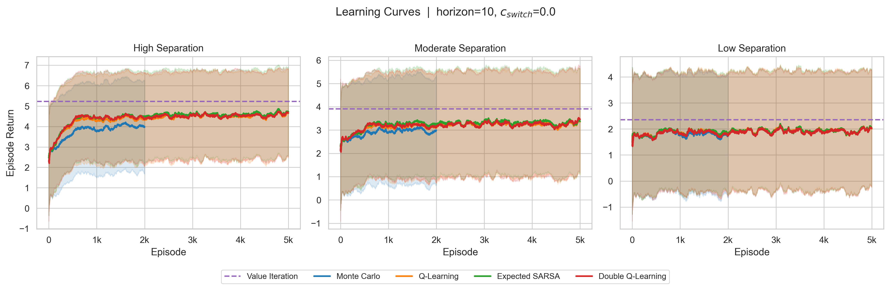
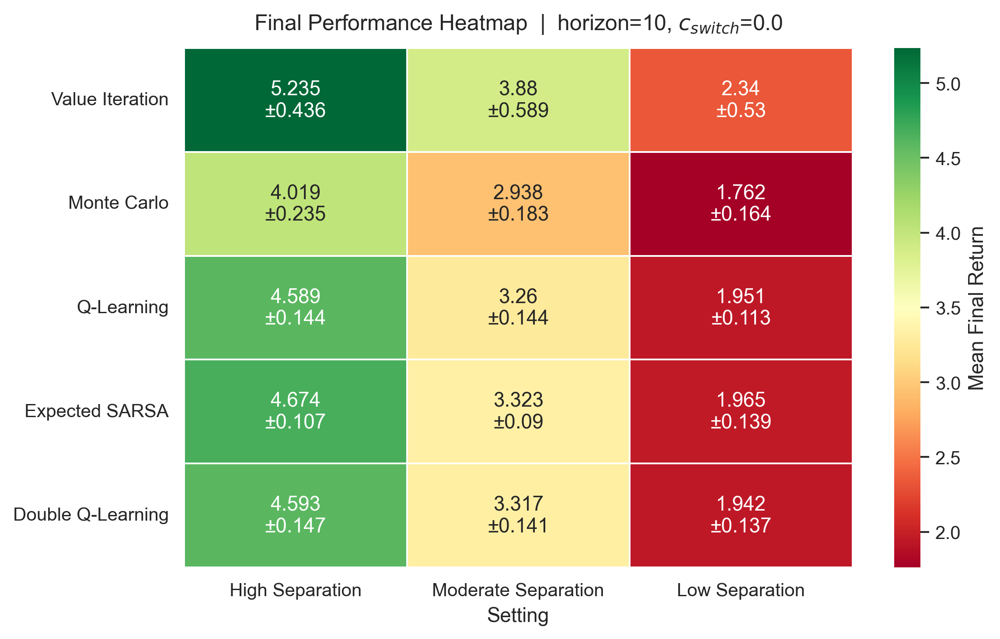
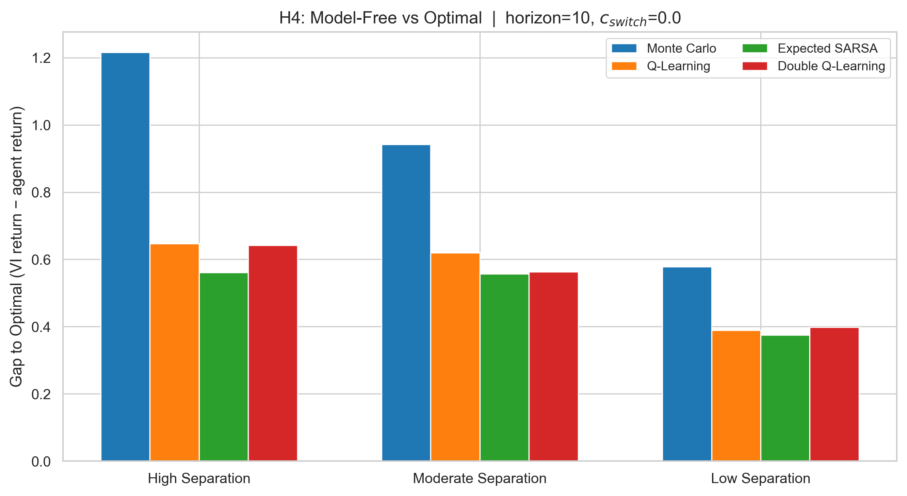
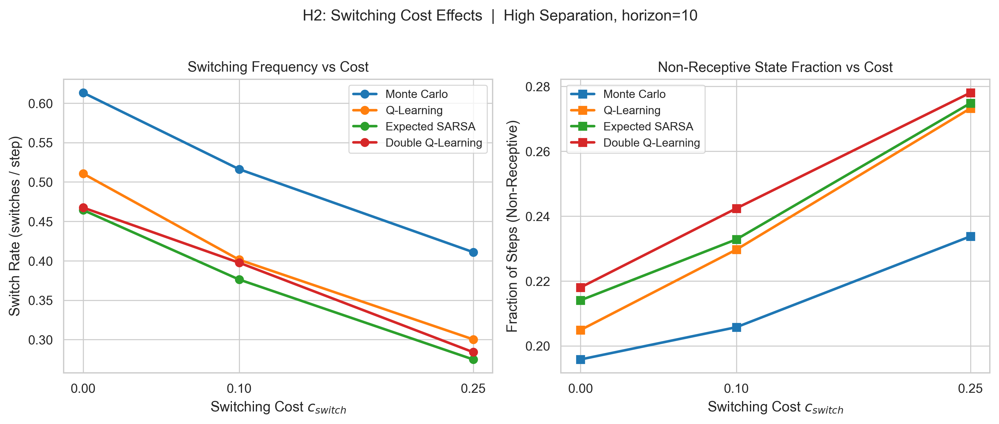
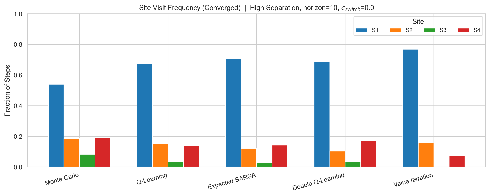
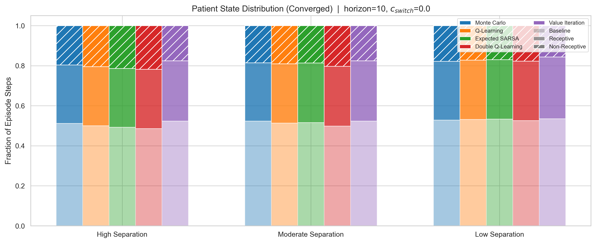
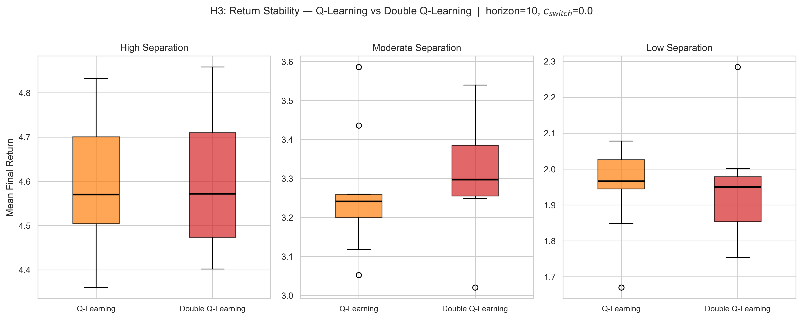
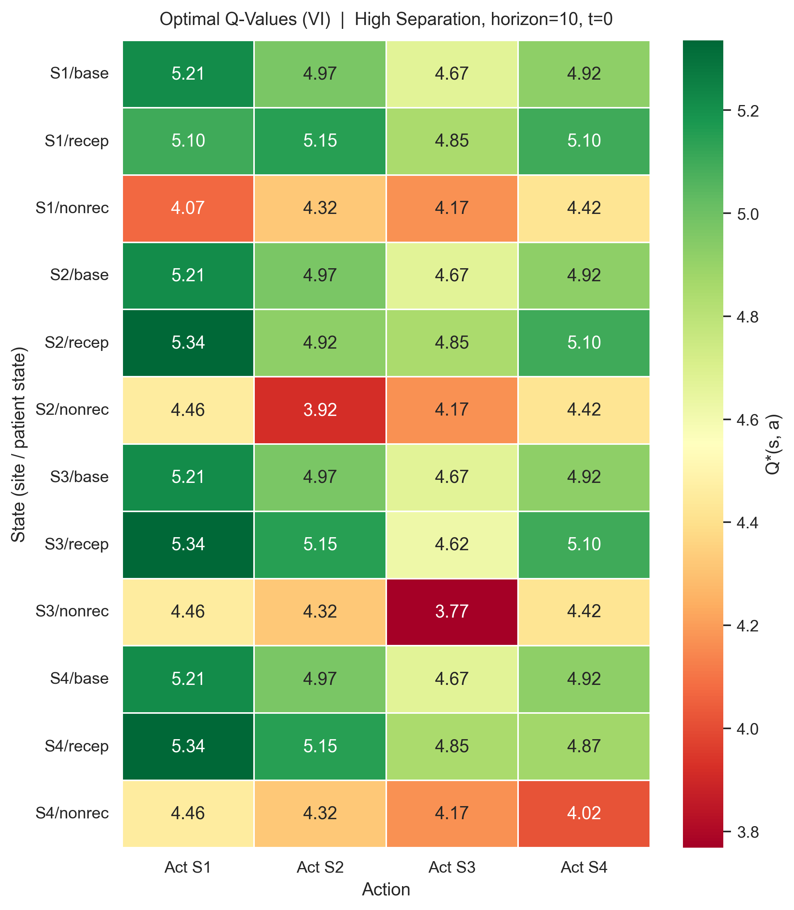
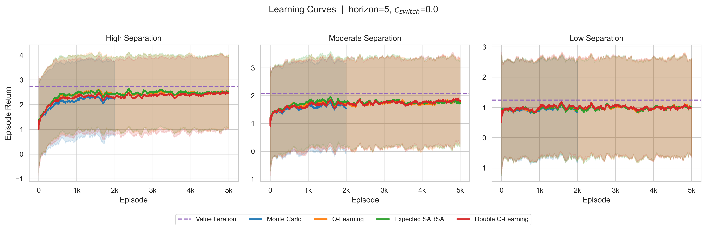

# Adaptive Multi-Site Stimulation Control Using Reinforcement Learning in an MDP

**Learning sequential stimulation policies under state-dependent EEG response dynamics**

**Authors:** Fatih Karatay and Cody Moxam
**Course:** EN.705.741.8VL Reinforcement Learning
**Date:** April 2026

---

## Abstract

We formulate adaptive multi-site brain stimulation as a finite-horizon Markov Decision Process (MDP) in which an agent selects among four stimulation sites to maximize cumulative reward derived from stochastic EEG responses. Patient responsiveness transitions stochastically among three states (baseline, receptive, non-receptive) as a function of stimulation history, coupling current actions to future reward and creating a genuine sequential control problem. We evaluate four model-free algorithms — Monte Carlo Control, Q-Learning, Expected SARSA, and Double Q-Learning — against a model-based Value Iteration benchmark across a factorial design of three response-separation settings, two episode horizons, and three switching-cost levels (90 total configurations, 10 seeds each). Statistical comparisons using Welch's t-tests reveal that the three temporal-difference (TD) methods significantly outperform Monte Carlo Control (p < 0.05 in all settings) while being statistically indistinguishable from one another (p > 0.17). Value Iteration significantly exceeds all model-free methods in the high and moderate separation settings (p < 0.05). Increasing switching cost significantly reduces switching frequency (Spearman rho = -0.83 to -0.94, p < 0.001) while simultaneously increasing non-receptive state occupancy (rho = 0.76 to 0.85, p < 0.001), revealing an explicit control tradeoff. Contrary to expectation, Double Q-Learning does not exhibit significantly lower return variance than Q-Learning (Levene's test, p > 0.65 in all settings).

## 1. Introduction

Brain stimulation site selection is often framed as choosing the single best target. In a static formulation, this reduces to a multi-armed bandit: the agent samples reward from fixed distributions and converges on the highest-paying option. However, clinical neurostimulation involves temporal dynamics — repeated stimulation of the same site can alter tissue responsiveness, and the resulting state changes affect future reward (Pineau et al., 2009). When actions influence future state occupancy, the problem becomes a sequential control task requiring reinforcement learning (RL).

We design a finite-horizon MDP that captures this sequential structure. An agent selects among four stimulation sites (S1–S4) at each timestep. Each stimulation produces a stochastic EEG observation whose distribution depends on both the chosen site and the current patient responsiveness state. Crucially, patient responsiveness evolves as a function of stimulation history: repeated stimulation of the same site increases the probability of transitioning to the non-receptive state, which degrades future reward quality. Switching to a different site promotes recovery toward baseline. An optional switching cost penalizes frequent site changes, creating a tradeoff between avoiding state degradation and minimizing transition penalties.

We compare four model-free RL algorithms against Value Iteration, which computes the optimal policy given full model knowledge. The model-free algorithms represent distinct learning paradigms: Monte Carlo Control uses complete episode returns, Q-Learning and Expected SARSA use single-step temporal-difference bootstrapping (off-policy and on-policy respectively), and Double Q-Learning addresses potential maximization bias in Q-Learning (Hasselt, 2010). Value Iteration serves as a performance upper bound rather than a competing method (Sutton & Barto, 2018, Ch. 4).

The response-separation setting controls how differentiated the sites are in terms of reward probability — ranging from high separation (one clearly dominant site) to low separation (nearly identical sites). This parameter modulates the difficulty of the learning problem and allows us to examine how algorithmic performance varies with environmental informativeness.

We evaluate the following hypotheses:

**H1.** Agents trained in higher-separation settings achieve higher mean final return than agents trained in lower-separation settings.

**H2.** Higher switching cost is associated with lower switching frequency and higher non-receptive state occupancy in converged policies.

**H3.** Double Q-Learning exhibits lower variance in per-seed mean final return compared to Q-Learning.

**H4.** Model-free agents achieve lower mean final return than the Value Iteration benchmark.

**H5.** Converged policies develop structured site preferences aligned with the reward model, rather than selecting sites uniformly.

## 2. Methods

### 2.1 MDP Formulation

The environment is a finite-horizon, fully observed, episodic MDP defined by the following components:

**State.** $s_t = (\text{current\_site}, \text{patient\_state}, t)$, where current\_site $\in \{\text{Start}, S_1, S_2, S_3, S_4\}$, patient\_state $\in \{\text{baseline}, \text{receptive}, \text{non-receptive}\}$, and $t \in \{0, 1, \dots, H\}$ is the timestep within the episode. The initial state is $s_0 = (\text{Start}, \text{baseline}, 0)$.

**Actions.** $a_t \in \{S_1, S_2, S_3, S_4\}$ — the agent selects one of four stimulation sites at each step.

**Patient-state transitions.** After the agent selects site $a_t$, the patient state transitions stochastically according to $T(p_{t+1} \mid p_t, \text{same\_site})$, where same\_site indicates whether the chosen site matches the current site. Table 1 specifies the transition probabilities. Repeated stimulation of the same site increases the probability of moving toward non-receptive, while switching promotes recovery toward baseline.

**Table 1. Patient-state transition probabilities $T(p' \mid p, \text{same\_site})$.**

| Current State | Action Type | &rarr; baseline | &rarr; receptive | &rarr; non-receptive |
|---|---|---|---|---|
| baseline | any | 0.60 | 0.30 | 0.10 |
| receptive | same site | 0.20 | 0.30 | 0.50 |
| receptive | different site | 0.50 | 0.30 | 0.20 |
| non-receptive | same site | 0.10 | 0.10 | 0.80 |
| non-receptive | different site | 0.40 | 0.30 | 0.30 |

**Observations and reward.** Each stimulation produces an EEG observation $o_{t+1} \sim P(o \mid a_t, p_t)$ drawn from a site- and state-dependent distribution. The observation maps deterministically to reward: $g(\text{favorable}) = +1$, $g(\text{neutral}) = 0$, $g(\text{unfavorable}) = -1$. An optional switching penalty applies when the agent changes site:

$$r_t = g(o_{t+1}) - c_{\text{switch}} \cdot \mathbf{1}[a_t \neq \text{current\_site}]$$

Table 2 gives the observation probabilities for the high-separation setting, in which sites are clearly differentiated and state-dependent reward degradation is most pronounced.

**Table 2. EEG observation probabilities $P(o \mid \text{site}, \text{patient\_state})$ — high-separation setting.**

| Site | Patient State | Favorable | Neutral | Unfavorable | E[reward] |
|---|---|---|---|---|---|
| S1 | baseline | 0.70 | 0.20 | 0.10 | +0.60 |
| S1 | receptive | 0.85 | 0.10 | 0.05 | +0.80 |
| S1 | non-receptive | 0.30 | 0.40 | 0.30 | 0.00 |
| S2 | baseline | 0.50 | 0.30 | 0.20 | +0.30 |
| S2 | receptive | 0.65 | 0.25 | 0.10 | +0.55 |
| S2 | non-receptive | 0.20 | 0.40 | 0.40 | -0.20 |
| S3 | baseline | 0.30 | 0.40 | 0.30 | 0.00 |
| S3 | receptive | 0.45 | 0.35 | 0.20 | +0.25 |
| S3 | non-receptive | 0.15 | 0.35 | 0.50 | -0.35 |
| S4 | baseline | 0.45 | 0.35 | 0.20 | +0.25 |
| S4 | receptive | 0.60 | 0.30 | 0.10 | +0.50 |
| S4 | non-receptive | 0.25 | 0.40 | 0.35 | -0.10 |

In the moderate-separation setting, sites differ less sharply (e.g., S1 baseline favorable probability drops from 0.70 to 0.60). In the low-separation setting, all sites have nearly identical observation distributions, so policy differences must arise primarily from patient-state management.

**Objective.** The agent maximizes expected undiscounted episodic return:

$$\max_{\pi} \; \mathbb{E}_{\pi}\!\left[\sum_{t=0}^{H-1} r_t\right]$$

**State space size.** With 5 site values, 3 patient states, and $H+1$ timesteps, the state space has $|S| = 5 \times 3 \times (H+1)$ states. For $H = 10$, $|S| = 165$ and $|S| \times |A| = 660$, making the problem fully tractable with tabular methods.

### 2.2 Algorithms

All agents use a tabular Q-table indexed by $(s, a)$ with $\varepsilon$-greedy exploration. Exploration decays exponentially: $\varepsilon_k = \max(\varepsilon_{\min},\; \varepsilon_0 \cdot d^k)$ where $k$ is the episode number, $\varepsilon_0 = 1.0$, $d = 0.995$, and $\varepsilon_{\min} = 0.05$. The learning rate is $\alpha = 0.1$ and the discount factor is $\gamma = 1.0$ (appropriate for finite-horizon tasks where total return matters).

**Monte Carlo Control** (Sutton & Barto, 2018, Ch. 5). On-policy, first-visit. The agent collects complete episode trajectories and updates Q-values using backward-computed returns $G_t = \sum_{k=0}^{H-1-t} r_{t+k}$ with constant step-size $\alpha$.

**Q-Learning** (Watkins & Dayan, 1992). Off-policy TD(0) control with update:

$$Q(s_t, a_t) \leftarrow Q(s_t, a_t) + \alpha\!\left[r_t + \gamma \max_{a'} Q(s_{t+1}, a') - Q(s_t, a_t)\right]$$

**Expected SARSA** (van Seijen et al., 2009; Sutton & Barto, 2018, Ch. 6). On-policy TD(0) control. The bootstrap target uses the expected value under the current $\varepsilon$-greedy policy:

$$Q(s_t, a_t) \leftarrow Q(s_t, a_t) + \alpha\!\left[r_t + \gamma \sum_{a'} \pi(a' \mid s_{t+1})\, Q(s_{t+1}, a') - Q(s_t, a_t)\right]$$

**Double Q-Learning** (Hasselt, 2010). Maintains two Q-tables $Q_1, Q_2$. At each step, one table is randomly selected for update using the other table's value estimates for the bootstrap target. Action selection is $\varepsilon$-greedy on $(Q_1 + Q_2)/2$.

**Value Iteration** (Sutton & Barto, 2018, Ch. 4). Computes the optimal value function via backward induction using the known transition and observation models:

$$V_t^*(s) = \max_a \sum_{s', r} P(s', r \mid s, a)\!\left[r + V_{t+1}^*(s')\right], \qquad V_H^*(s) = 0$$

The resulting optimal policy is evaluated over 200 rollout episodes.

### 2.3 Experimental Design

Experiments follow a full-factorial design: 3 response-separation settings (high, moderate, low) $\times$ 2 episode horizons ($H \in \{5, 10\}$) $\times$ 3 switching costs ($c_{\text{switch}} \in \{0, 0.1, 0.25\}$) $\times$ 5 algorithms = 90 configurations. Each model-free configuration is run across 10 independent random seeds with 5,000 training episodes per seed. Value Iteration computes the exact optimal policy and evaluates it over 200 stochastic rollout episodes per seed.

The primary analysis focuses on the representative long-horizon, no-switching-cost setting ($H = 10$, $c_{\text{switch}} = 0$). Switching-cost effects are analyzed across all three cost levels in the high-separation setting.

### 2.4 Performance Evaluation and Statistical Methods

**Performance measure.** The primary metric is the *mean final return*: the average episodic return computed over the last 10% of training episodes (episodes 4,501–5,000), then averaged across the 10 seeds. At this point in training, $\varepsilon$ has decayed to its floor of 0.05, so the agent follows a near-greedy policy. Each seed produces one scalar (its mean return over episodes 4,501–5,000), yielding 10 independent observations per algorithm-setting combination.

**Pairwise algorithm comparisons.** To compare two algorithms within the same setting, we apply Welch's t-test (unequal-variance two-sample t-test) to the 10 per-seed mean final returns of each algorithm. We report p-values and consider results significant at the $\alpha = 0.05$ level. This test is appropriate because the per-seed means are independent observations and the Central Limit Theorem supports approximate normality of the sample means.

**Variance comparisons (H3).** To test whether Double Q-Learning produces lower return variance than Q-Learning, we apply Levene's test to the per-seed mean final returns.

**Association tests (H2).** To test the relationship between switching cost and behavioral metrics, we compute Spearman rank correlations across the three cost levels using per-seed measurements (30 observations per algorithm: 10 seeds $\times$ 3 cost levels).

## 3. Results

### 3.1 Reward separability improves learning performance (H1)

Figure 1 shows learning curves for all five methods at $H = 10$, $c_{\text{switch}} = 0$. In the high-separation setting, the TD methods stabilize near mean episode returns of 4.6–4.7 while Monte Carlo stabilizes lower near 4.1. In moderate separation the same ranking persists but compresses downward (3.1–3.3 for TD methods). In low separation, all model-free methods flatten near 1.8–2.0. Value Iteration provides the upper bound in all settings. The same qualitative ordering holds for $H = 5$ (Appendix A, Figure A2), with lower total returns due to the shorter episode.

Welch's t-tests confirm that H1 is strongly supported: every model-free algorithm achieves significantly higher mean final return in the high-separation setting than in the low-separation setting (all p < 0.001). For example, Q-Learning achieves 4.589 $\pm$ 0.144 in high separation versus 1.951 $\pm$ 0.113 in low separation ($t = 43.3$, $p < 0.001$).

*Figure 1. Learning curves for $H = 10$, $c_{\text{switch}} = 0$. Smoothed mean $\pm$ 1 std across 10 seeds. Value Iteration (dashed) provides the upper bound. TD methods stabilize above Monte Carlo in all settings, with separation level controlling the achievable return scale.*

### 3.2 Cross-setting performance summary

Table 3 reports mean final return $\pm$ standard deviation (across 10 seeds) for all algorithm-setting combinations at $H = 10$, $c_{\text{switch}} = 0$.

**Table 3. Mean final return $\pm$ std ($H = 10$, $c_{\text{switch}} = 0$, $n = 10$ seeds).**

| Algorithm | High Separation | Moderate Separation | Low Separation |
|---|---|---|---|
| Value Iteration | 5.235 $\pm$ 0.436 | 3.880 $\pm$ 0.589 | 2.340 $\pm$ 0.530 |
| Expected SARSA | 4.674 $\pm$ 0.107 | 3.323 $\pm$ 0.090 | 1.965 $\pm$ 0.139 |
| Double Q-Learning | 4.593 $\pm$ 0.147 | 3.317 $\pm$ 0.141 | 1.942 $\pm$ 0.137 |
| Q-Learning | 4.589 $\pm$ 0.144 | 3.260 $\pm$ 0.144 | 1.951 $\pm$ 0.113 |
| Monte Carlo | 4.081 $\pm$ 0.232 | 3.059 $\pm$ 0.140 | 1.801 $\pm$ 0.128 |

Monte Carlo is significantly below all three TD methods in every setting (Welch's t-test, p < 0.05; e.g., MC vs. Q-Learning in high separation: $t = -5.58$, $p < 0.001$). The three TD methods are *not* significantly different from one another in any setting (all pairwise p > 0.17). Expected SARSA achieves the highest point estimate among model-free methods in all three settings, but this ordering is not statistically distinguishable from Q-Learning or Double Q-Learning given the sample sizes.

The performance heatmap in Figure 2 visualizes these results.

*Figure 2. Mean final return heatmap, $H = 10$, $c_{\text{switch}} = 0$. Cell annotations show mean $\pm$ std. Value Iteration leads in every setting. The three TD methods cluster together, with Monte Carlo consistently trailing.*

### 3.3 Gap to optimal benchmark (H4)

Figure 3 shows the gap between each model-free algorithm's mean final return and the Value Iteration benchmark. In the high-separation setting, all model-free methods are significantly below Value Iteration (Welch's t-test, p < 0.01). In moderate separation, the gap remains significant for all methods (p < 0.05). In low separation, Monte Carlo is significantly below Value Iteration ($p = 0.014$), but the TD methods are only marginally non-significant ($p = 0.054$–$0.066$), reflecting both the smaller absolute gap and the higher variance of Value Iteration rollouts in this setting.

These results support H4: Value Iteration provides a meaningful upper-bound benchmark that model-free methods approach but do not reach, particularly in higher-separation settings. In relative terms, the TD methods achieve 84–89% of the Value Iteration return across settings (e.g., Expected SARSA reaches 4.674/5.235 = 89% of VI in high separation), substantially narrowing the gap left by Monte Carlo (78% of VI in high separation).

*Figure 3. Gap to optimal ($\text{VI return} - \text{agent return}$) at $H = 10$, $c_{\text{switch}} = 0$. Monte Carlo has the largest gap in all settings. The three TD methods cluster together with smaller gaps.*

### 3.4 Switching cost shapes policy behavior (H2)

Figure 4 shows how switching behavior changes as $c_{\text{switch}}$ increases from 0 to 0.25 in the high-separation setting. The left panel shows that switch rate (switches per step) decreases monotonically for every algorithm. The right panel shows that non-receptive state occupancy increases simultaneously.

Spearman rank correlations confirm strong statistical associations. For each model-free algorithm, switching frequency is negatively correlated with $c_{\text{switch}}$ ($\rho = -0.83$ to $-0.94$, all $p < 0.001$) and non-receptive occupancy is positively correlated with $c_{\text{switch}}$ ($\rho = 0.76$ to $0.85$, all $p < 0.001$). Table 4 shows the specific behavioral metrics at each cost level.

**Table 4. Switching rate and non-receptive fraction by switching cost (high separation, $H = 10$).**

| Algorithm | $c = 0$ switch rate | $c = 0.1$ | $c = 0.25$ | $c = 0$ non-rec | $c = 0.1$ | $c = 0.25$ |
|---|---|---|---|---|---|---|
| Monte Carlo | 0.625 | 0.551 | 0.427 | 0.195 | 0.200 | 0.237 |
| Q-Learning | 0.511 | 0.401 | 0.300 | 0.205 | 0.230 | 0.273 |
| Expected SARSA | 0.464 | 0.376 | 0.275 | 0.214 | 0.233 | 0.275 |
| Double Q-Learning | 0.467 | 0.398 | 0.284 | 0.218 | 0.242 | 0.278 |

These results strongly support H2. The tradeoff is particularly informative: agents that switch less avoid the explicit penalty but spend more time in the non-receptive state, which degrades future reward quality. Effective policies must balance both costs rather than minimizing either one alone.

*Figure 4. Switching cost effects in the high-separation setting, $H = 10$. Left: switch rate decreases with cost. Right: non-receptive state occupancy increases with cost. All trends are statistically significant (Spearman $|\rho| > 0.76$, $p < 0.001$).*

### 3.5 Site preference and state-aware behavior (H5)

Figure 5 shows converged site visit frequencies in the high-separation setting. All algorithms concentrate the majority of their actions on S1, the site with the highest expected reward in the baseline and receptive states (Table 2). Value Iteration is most concentrated, placing approximately 77% of actions on S1 and nearly zero on S3. The TD methods allocate 67–71% to S1. Monte Carlo is more diffuse, with only 53% on S1 and larger shares on S2 and S4.

The non-uniform site preferences confirm that converged policies are structured rather than random, supporting H5. The degree of concentration correlates with algorithm performance: better-performing methods concentrate more on the highest-value site while retaining some switching to manage patient state.

Figure 6 shows converged patient-state distributions. All algorithms maintain baseline-plus-receptive occupancy of 79–84% of episode time. Value Iteration achieves the lowest non-receptive occupancy (approximately 0.175 across settings), consistent with its superior performance.

*Figure 5. Converged site visit frequency in the high-separation setting, $H = 10$, $c_{\text{switch}} = 0$. All methods prefer S1. Value Iteration concentrates most aggressively; Monte Carlo distributes visits most broadly.*

*Figure 6. Converged patient-state distribution, $H = 10$, $c_{\text{switch}} = 0$. Across algorithms and settings, baseline-plus-receptive states account for the majority of episode time. Value Iteration consistently achieves the lowest non-receptive occupancy.*

### 3.6 Stability comparison: Q-Learning vs. Double Q-Learning (H3)

Figure 7 compares per-seed mean final return distributions for Q-Learning and Double Q-Learning using box plots. In high separation, the two distributions are nearly identical. In moderate separation, Double Q-Learning has a slightly higher median. In low separation, the distributions again overlap substantially.

Levene's test for equality of variances finds no significant difference in any setting: $p = 0.780$ (high), $p = 0.920$ (moderate), $p = 0.650$ (low). The observed variances are nearly identical (e.g., 0.0206 vs. 0.0216 in high separation). H3 is **not supported**: Double Q-Learning does not exhibit meaningfully lower return variance than Q-Learning in this experimental suite.

This null result is consistent with the structure of the environment. The state-action space is small ($|S \times A| = 660$ for $H = 10$), so maximization bias in Q-Learning's $\max$ operator has limited scope to cause instability. In larger or more complex environments, the advantage of Double Q-Learning may be more pronounced.

*Figure 7. Per-seed mean final return distributions, $H = 10$, $c_{\text{switch}} = 0$. Q-Learning and Double Q-Learning show no significant difference in variance (Levene's test, $p > 0.65$ in all settings). H3 is not supported.*

### 3.7 Summary of hypothesis outcomes

| Hypothesis | Outcome | Test | Key Result |
|---|---|---|---|
| H1: Higher separation $\rightarrow$ higher return | **Supported** | Welch's t-test | High vs. low: all algorithms $p < 0.001$ |
| H2: Higher $c_{\text{switch}}$ $\rightarrow$ less switching, more non-receptive | **Supported** | Spearman correlation | $|\rho| > 0.76$, $p < 0.001$ for all algorithms |
| H3: Double Q-Learning has lower return variance | **Not supported** | Levene's test | $p > 0.65$ in all settings |
| H4: Model-free $<$ Value Iteration | **Supported** | Welch's t-test | Significant in high and moderate settings ($p < 0.05$) |
| H5: Converged policies show structured site preferences | **Supported** | Qualitative | S1 concentration 53–77% vs. uniform 25% baseline |

## 4. Discussion

This finding supports the main argument of this project: if patient responsiveness changes stochastically depending on stimulation history, site selection becomes a sequential decision-making problem. We can see this in the results. The learning curves indicate that all learning agents outperform the baseline static policies. The switching-cost experiments demonstrate that the agents learn to account for the switching cost, but cannot escape from the dilemma as a lower number of switches implies non-receptiveness. Site frequency plots show structured policies aligned with expected rewards.

However, by far the most impressive finding is the statistical equivalence between all three tested TD approaches, which are different in their algorithmic details. As Q-Learning is the off-policy variant of action value maximization, Expected SARSA is on-policy action value averaging, while Double Q-Learning reduces bias associated with the former approach (by using two value tables simultaneously), they perform equally well across all separation scenarios. The result indicates that in the presented tabular MDP with a relatively small state-action space, the difference between TD approaches does not play as important a role as bootstrap per se compared to the use of episode returns. In particular, the consistently low performance of Monte Carlo can be attributed to slower credit assignment in a finite-horizon MDP, where patient states affect rewards in the future due to patient-state transitions. Single-step bootstrap allows to propagate reward information faster than the full-episode approach.

Finally, special attention should be paid to the failure to reject H3. Double Q-Learning is supposed to improve agent stability by reducing maximization bias (associated with the use of max operator in Q-Learning) in an environment where this bias emerges (Hasselt, 2010). While the lack of difference may be expected in this case because of limited state-action space and bounded rewards (r ∈ [−1, +1] before accounting for switching cost), the fact that such a difference may occur indicates that this method may be helpful in other environments.

As already mentioned, the switching cost dilemma (Section 3.4) is perhaps the best example of why this problem is a sequential decision problem. In the bandit problem, switching cost would simply serve as a punishment for switching, so that the optimal strategy would consist in finding the best arm and continuing to use it. In our problem, staying at one site for too long brings a risk of transitioning into non-receptive patient states.

## 5. Limitations

This environment is intended to be a simplified simulation that generates interpretable RL structure, as opposed to a biophysically validated clinical model. The transition dynamics and EEG response distributions (Tables 1-2) have been arbitrarily selected to generate interesting trade-offs, without clinical calibration.

The state space and observation spaces are intentionally discrete and small, which allows for a fair comparison between different tabular RL techniques, but renders the task less immediately applicable to the clinical setting. A natural next step could involve making the problem partially observable, with the patient's true state not being directly observed (a clinically relevant extension to the POMDP formulation).

The primary analysis examines a representative slice of the parameter space ($H=10$, $c_{\text{switch}}=0$) and several sweeping experiments varying the switching cost parameter. All 90 results reported from the complete configuration sweep have been independently computed. Appendix A presents the learning curves for the $H=5$ case.

The performance of the model-free RL agents is evaluated during training at the exploration floor $\varepsilon=0.05$. Value Iteration, in contrast, performs optimally according to a fully deterministic policy. The minimal amount of residual exploration employed hinders the model-free algorithms, but only by an upper bound $\varepsilon\times$(random-greedy gap).

## 6. Conclusion

An adaptive multi-site stimulation control model based on finite-horizon MDP was constructed, with a state that represents patient sensitivity changing over time according to stimulation history. In 90 different settings, all three temporal difference models (Q-Learning, Expected SARSA, Double Q-Learning) yielded nearly equivalent results and clearly outperformed Monte Carlo Control, with Value Iteration providing a reasonable upper bound for performance. Higher switching costs decrease switching rates but increase exposure to non-receptive states. This shows a true sequential control dilemma. No clear advantage of Double Q-Learning over Q-Learning could be observed in terms of stability.

This project shows that state-sensitive responsiveness dynamics render the selection of appropriate sites a true reinforcement learning task, as the optimal policy takes care of more than one thing at a time.

## References

- Hasselt, H. van. (2010). Double Q-Learning. *Advances in Neural Information Processing Systems*, 23, 2613–2621.
- Pineau, J., Guez, A., Vincent, R., Panuccio, G., & Bhomick, S. (2009). Treating epilepsy via adaptive neurostimulation: A reinforcement learning approach. *International Journal of Neural Systems*, 19(4), 227–240.
- Sutton, R. S., & Barto, A. G. (2018). *Reinforcement Learning: An Introduction* (2nd ed.). MIT Press.
- van Seijen, H., van Hasselt, H., Whiteson, S., & Wiering, M. (2009). A theoretical and empirical analysis of Expected Sarsa. *IEEE Symposium on Adaptive Dynamic Programming and Reinforcement Learning*, 177–184.
- Watkins, C. J. C. H., & Dayan, P. (1992). Q-Learning. *Machine Learning*, 8(3–4), 279–292.

## Appendix A. Additional Figures

Figure A1 shows the optimal Q-value surface from Value Iteration at $t = 0$ in the high-separation setting. The heatmap confirms that the optimal policy is state-dependent: from baseline and receptive states, action S1 is generally preferred, but from non-receptive states the preferred action shifts as the agent seeks to switch sites and promote recovery.

*Figure A1. Optimal Q-values from Value Iteration at $t = 0$, high-separation setting, $H = 10$. Rows: (site, patient state) pairs. Columns: actions. The optimal policy shifts with patient state, confirming state-dependent sequential control.*

Figure A2 shows learning curves for the short-horizon setting ($H = 5$, $c_{\text{switch}} = 0$). The same qualitative ranking holds: TD methods outperform Monte Carlo, and Value Iteration provides the upper bound. The achievable return scale is lower because episodes are shorter.

*Figure A2. Learning curves for $H = 5$, $c_{\text{switch}} = 0$. The same algorithm ranking holds as in the $H = 10$ setting, but total return is lower due to the shorter episode.*
