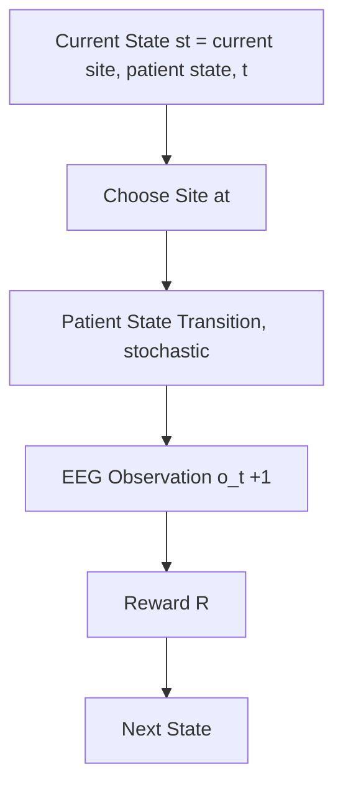

# Adaptive Multi-Site Stimulation Control Using RL in an MDP

## Learning sequential stimulation policies under state-dependent EEG response dynamics

**Team Members**: Fatih Karatay & Cody Moxam
**Class**: EN.705.741.8VL Reinforcement Learning

## Game

- Summary of the Test-Then-Treat (T3) Game
  - Agent:
    - Single RL agent (decision-maker)
- Environment:
  - Stochastic
  - Episodic
  - Finite-horizon MDP
- Tokens:
  - Stimulation Sites (S1, S2, S3, S4): Four discrete brain regions the agent can target
  - Start State: Initial state before any stimulation is applied.
  - Patient State Indicator: A latent internal state {baseline, receptive, non-receptive} reflecting cumulative physiological response to stimulation history — dynamic, transitions stochastically based on agent actions
    - Repeated stimulation of the same site can transition the patient from baseline -> receptive -> nonreceptive, affecting future reward quality
  - EEG Response Signal: Categorical observation returned after each stimulation o ∈ {favorable, neutral, unfavorable} — dynamic, sampled from P(o | site, patient_state)
  - Episode Counter (t): Tracks time step within the finite horizon — dynamic, controlled by environment

- Goal
  - Maximize expected episodic return by learning which stimulation sites to choose and when to switch over a finite horizon, accounting for how the patient’s state evolves.
- MDP components
  - State: $s_t = (current site, patient state, t)$ where patient state $∈ (baseline, receptive, non-receptive)$
  - Actions: $a_t= (S1, S2, S3, S4)$
  - Observations: $O_{t+1} ~ P(o | a_t, patientstate_t)$
  - Observation model: $P(o_{t+1} | a_t, patientstate_t)$ depends on BOTH site and patient state
  - Patient State Transition: $T(patientstate_{t+1} | patient_state_t, a_t)$ [stochastic]
  - Reward: $rt = g(o_{t+1}) - cswitch 1$ at not equal to current site
- Why MDP:
  - The next outcome depends only on the current state and chosen action; there is no hidden latent state.
- Why this is RL (not a bandit):
  - Stimulating the same site repeatedly drives the patient toward receptive then non-receptive
  - Switching sites allows recovery toward "baseline” and exploitation of other rewarding sites
  - Actions taken now change the distribution of future states which delayed consequences require sequential credit assignment
